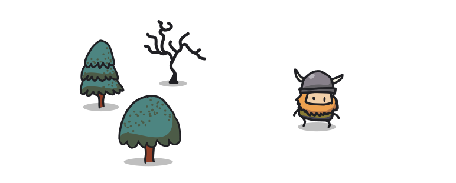
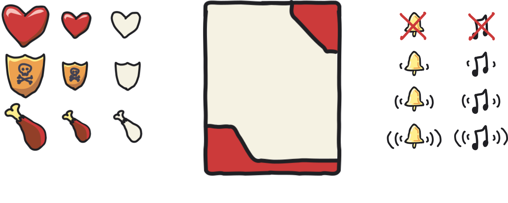
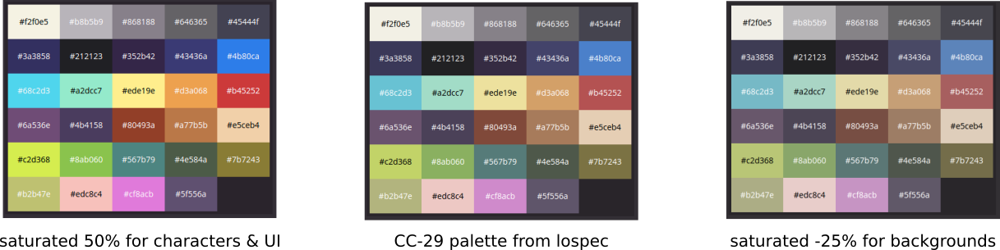
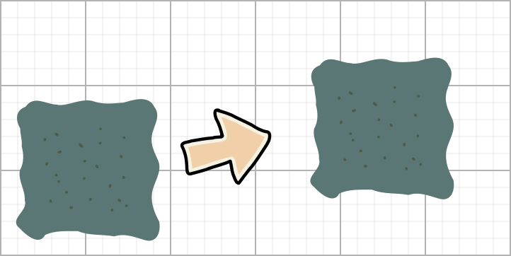

# Doodle Rogue Tileset

Thanks for downloading the Doodle Rogue tileset.
This info is to help you use it in your game, and extend it if you need to draw your own additions.

 
 
 
 

<a href="https://chr15m.itch.io/doodle-rogue-tileset">https://chr15m.itch.io/doodle-rogue-tileset</a>

Doodle Rogue is [CC BY-ND](https://creativecommons.org/licenses/by-nd/4.0/) licensed. You can use it for commercial purposes.

## Extras

In the `extras` folder you can find various user-interface graphics - cards, audio icons, and HUD graphics for life, food, armour etc.

## Palettes

Doodle Rogue uses the "CC-29" palette from the Lospec website.
<https://lospec.com/palette-list/cc-29>

For characters and UI the palette is saturated by 50% and for backgrounds it's desaturated by -25%.
If you draw your own additions you can use the same palette to have the colors match.

## Animations

You can animate the characters by cycling the character tiles in the top two rows with those in rows 3 & 4 every half second. So for example to animate the goblin you would first show tile 0,1 and then half a second later show tile 0,4, and then continue the cycle with a half second pause between each change.

The other animated tile is the sparkles. You can cycle through the three tiles from tile 5,2 to tile 7,2 and they make a sparkle animation. You an overlay this on e.g. items to make them appear magical.

The fifth row of tiles are "swipe" animations for showing combat hits and misses. You can overlay these swipes on characters and monsters temporarily when they receive a hit (red) or a miss (yellow) to give your combat sequences some life.

## Background tile alts

There are two sets of background tiles for two different worlds.
The tilesets feature the same tiles but offset by 7.
So you can draw a single background and switch between tilesets simply by adding an offset of 7 to the tile index.

## Suggested fonts

Doodle Rogue can be paired with pretty much any handwriting font. You can filter most font browsers for the "handwritten" tag.

Some fonts we can recommend are Patrick Hand, Gochi Hand, and Pricess Sofia.

## Floor tiles

Dirt and rock/road floor tiles can be found at 0,11 to 1,12. Grass and sand floor tiles can be found at 5,15 and 6,15.

You also have the option of drawing blended/wavy grass and sand tiles using rows 0,13 to 7,14. The idea with these tiles is you take all four tiles in each blob and draw them offset by 0.5 tiles left and up. By stamping these blobs on top of the dirt/rock tiles you can get an effect of seamless non-blocky backgrounds.

## Extending Doodle Rogue

If you want you can add your own tiles or sprites. Here is the basic process:

1. Use a tablet with a stylus to draw fixed-width outlines.
2. Export as SVG and import onto your computer.
3. Color the tiles using the same palette.

**Please note**: you may add your own tiles to use in your work but you may not redistribute a modified version of Doodle Rogue as a tileset.

Contributions are most welcome. Email <chris@mccormick.cx> if you have a contribution to the tileset.

## Thanks!

That's it. Please let me know if there are any tiles or sprites you would like to see added to Doodle Rogue.

Have fun!
